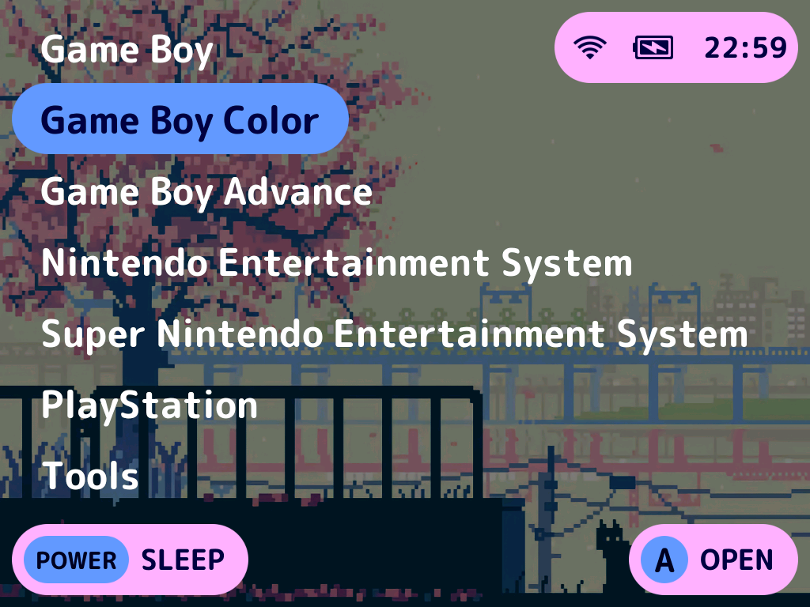

# _Mortar_

A download client for your TrimUI Brick running NextUI.

Supports RomM, SMB, Megathread, Apache / nginx mod_autoindex & HTML tables.

---



---

## How do I setup Mortar?

1. Own a TrimUI Brick and have a SD Card with NextUI configured.
2. Connect your Brick to a Wi-Fi network.
3. Download the latest Mortar release from this repo.
4. Unzip the release download.
5. Edit one of the templates in the `config_examples` directory. Once done save it as `config.yml` inside the
   `Mortar.pak` directory.
6. With your Brick powered off, eject the SD Card and connect it to your computer.
7. Copy the entire Mortar.pak file to `SD_ROOT/Tools/tg5040`.
8. Reinsert your SD Card into your Brick.
9. Launch Mortar from the `Tools` menu and enjoy!

## Configuration File Instructions

### RomM Support

Here is a sample configuration for RomM.

```yaml
hosts:
  - display_name: "RomM"
    host_type: ROMM
    root_uri: ""
    port: 1550
    username: ""
    password: ""

    sections:
      - section_name: "Game Boy Color"
        romm_platform_id: "3"
        local_directory: "/mnt/SDCARD/Roms/2) Game Boy Color (GBC)/"

show_item_count: false
```

**Note:** The Mortar RomM configuration requires a `romm_platform_id` instead of the usual `host_subdirectory`.

***

### SMB Support

Here is a sample configuration for an SMB server.

```yaml
hosts:
  - display_name: "SMB Test"
    host_type: SMB
    root_uri: "192.168.1.20"
    port: 445
    username: "GUEST"
    password: ""
    share_name: "guest"

    extension_filters:
      - ".DS_Store"

    sections:
      - section_name: "Game Boy Advance"
        host_subdirectory: "GBA/"
        local_directory: "/mnt/SDCARD/Roms/Game Boy Advance (GBA)/"

show_item_count: false

```

***

### Megathread / Apache / nginx mod_autoindex & Arbitrary HTML Tables

Mortar comes pre-configured for three host types.

1. Megathread
2. Apache
3. nginx

These three defaults simplify the configuration process as they have default rules for parsing and cleaning the HTML
tables. Don't worry you are not tied to these three options.

Here is a complete example for any of the defined servers above.

```yaml
hosts:
  - display_name: "My Server"
    host_type: APACHE # NGINX | MEGATHREAD
    root_uri: ""

    sections:
      - section_name: "Game Boy"
        host_subdirectory: "/GB/"
        local_directory: "/mnt/SDCARD/Roms/Game Boy (GB)/"
      - section_name: "Game Boy Color"
        host_subdirectory: "/GBC/"
        local_directory: "/mnt/SDCARD/Roms/Game Boy Color (GBC)/"

    filters:
      - "USA"
      - "En,"

show_item_count: false
```

Change `host_type` to match your host, configure the `root_url` and add or remove the sections to your liking.

***

A custom host requires a few extra settings.

Here you must define a filename header, file size header and a date header.

Additionally, you can configure source replacements. These will run before the HTML is parsed.

For example if your table header has arrows that render for sorting in the browser you'll want to specify them here to
be removed. Doing these replacements will make the resulting data that Mortar displays cleaner and more readable.

```yaml
hosts:
  - display_name: "Custom HTML Table"
    host_type: CUSTOM
    root_url: ""

    sections:
      - section_name: "Game Boy"
        host_subdirectory: "/files/GB/" # Note the trailing slash
        local_directory: "/mnt/SDCARD/Roms/Game Boy (GB)/" # Note the trailing slash
      - section_name: "Game Boy Color"
        host_subdirectory: "/files/GBC/"
        local_directory: "/mnt/SDCARD/Roms/Game Boy Color (GBC)/"
      - section_name: "Game Boy Advance"
        host_subdirectory: "/files/GBA/"
        local_directory: "/mnt/SDCARD/Roms/Game Boy Advance (GBA)/"

    table_columns:
      filename_header: "File Name"
      file_size_header: "File Size"
      date_header: "Date"

    source_replacements:
      "  ↓": ""
      "[[": "[["
      "]]": "]]"

    filters:
      - "USA"
      - "En,"

show_item_count: false
```

***

I should probably explain some of the non-self-explanatory options.

**Sections** deal with the main menu for Mortar.

The sections are displayed in the order you add them to the section array.

`host_subdirectory` corresponds to the subdirectory on the host where the files are located.
e.g. if the address to your HTML table is `http://192.168.1.20/files/GB/` your `host` would be `http://192.168.1.20` and
your `host_subdirectory` would be `/files/GB` (note the leading and trailing slashes).

`local_directory` corresponds to where you want Mortar to place the files downloaded for this section. To get to the
root of your ROMs folder use this path `/mnt/SDCARD/Roms`. You can then complete the rest of the path to match the
naming scheme you chose for your Brick. *Just be sure to end the path with a slash*

**Filters** do exactly that filter. While Mortar has a basic search feature, a table with many entries can become
unwieldy.

To fix this you can specify filters. These filters are *inclusive*, that is you are specify what you want to be
included. For example if you are filtering a list of ROMs and want to only display ones in English you could use the
filter `En`. Any file with `En` in the filename will be included in the resulting list.

_Note: These filters are applied pre-search._

## Gotchas

While testing, I came across some gotchas. Here is what I caught.

- Filtering Language Tags
    - When using the filter feature on language tags `e.g. Filename (USA) (En, Fr, Jp).zip`, use the trailing comma or
      parenthesis so that my naive filtering implementation (*`<cough>`* string compares *`</cough>`*) doesn't just
      filter the filename.

- Apache Hosts
    - Apache host running mod_autoindex by default truncate their table file names.
    - To fix this, use the following `.htaccess` file in the parent directory of the files being served.

```
Options +Indexes
<IfModule mod_autoindex.c>
  IndexOptions NameWidth=*
</ifModule>
```

- nginx Hosts
    - nginx also truncates their filenames
    - To fix this, add these to your nginx config for the appropriate location

```
location / {
    root   /usr/share/html;
    index  index.html index.htm;
    
    autoindex on;
    autoindex_exact_size off;
    autoindex_format json;
    autoindex_localtime on;
}
```

## 🌸 Flower Giving Time! 🌸

Just want to give a huge shoutout
to [@ro8inmorgan](https://github.com/ro8inmorgan), [@frysee](https://github.com/frysee) and the rest of the NextUI
contributors for making the TrimUI
Brick an amazing experience. Also huge props to the work [@shauninman](https://github.com/shauninman) put into MinUI of
which NextUI is based.

I want to also shoutout [@josegonzalez](https://github.com/josegonzalez) for their
awesome [minui-list](https://github.com/josegonzalez/minui-list), [miniui-presenter](https://github.com/josegonzalez/minui-presenter)
and [minui-keyboard](https://github.com/josegonzalez/minui-keyboard) projects.

Without these phenomenal pieces of software I likely would not have built Mortar.

✌️
